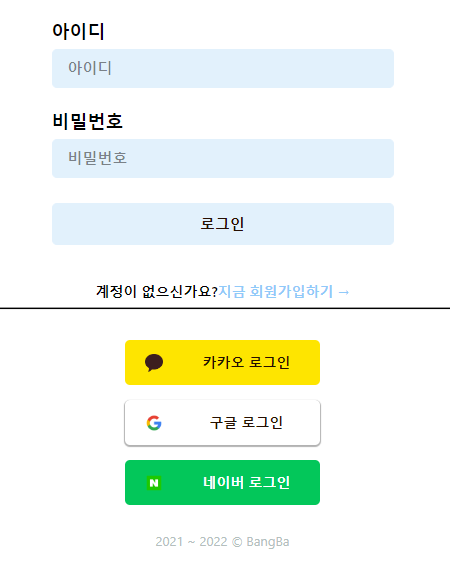
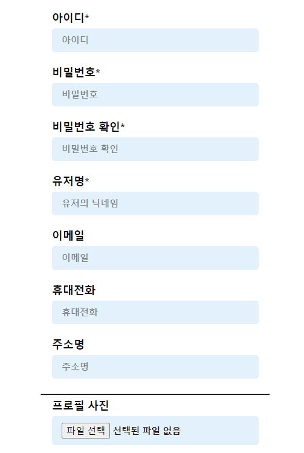
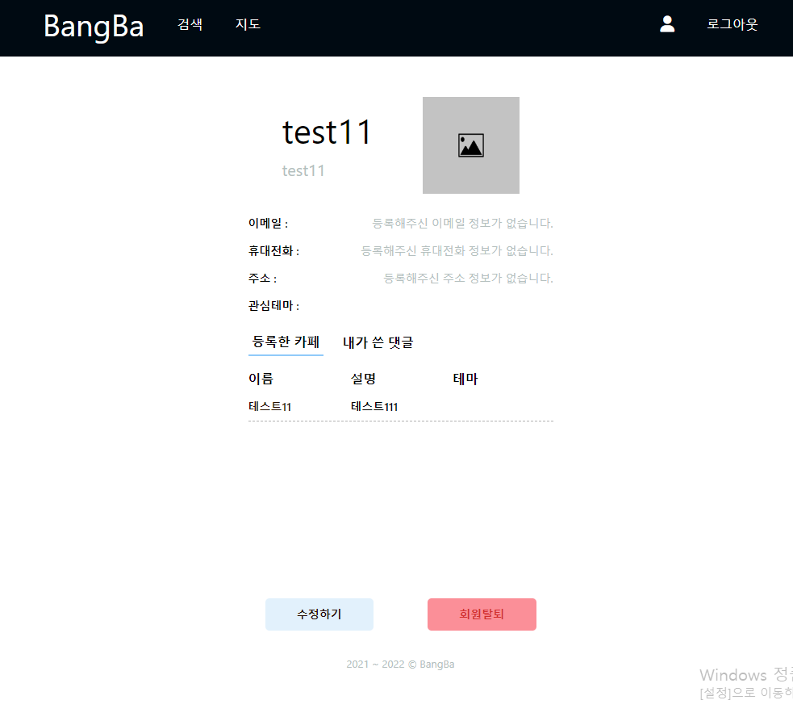
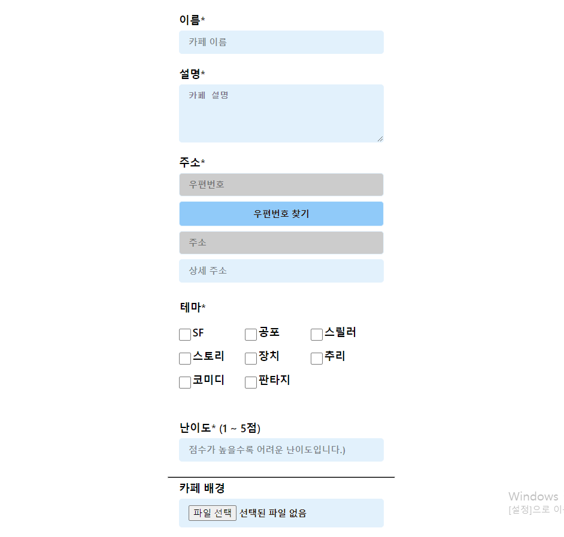
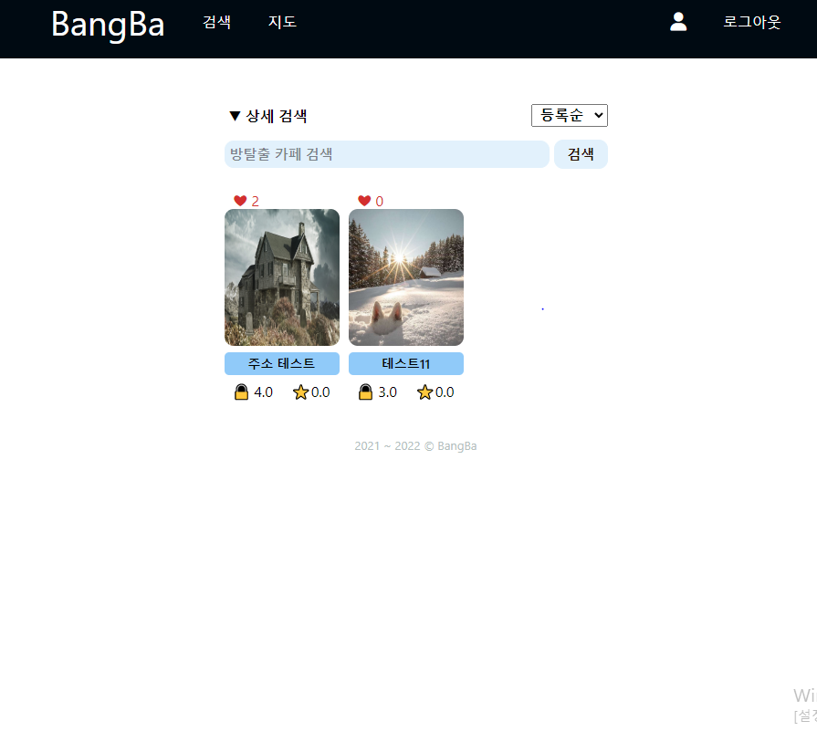
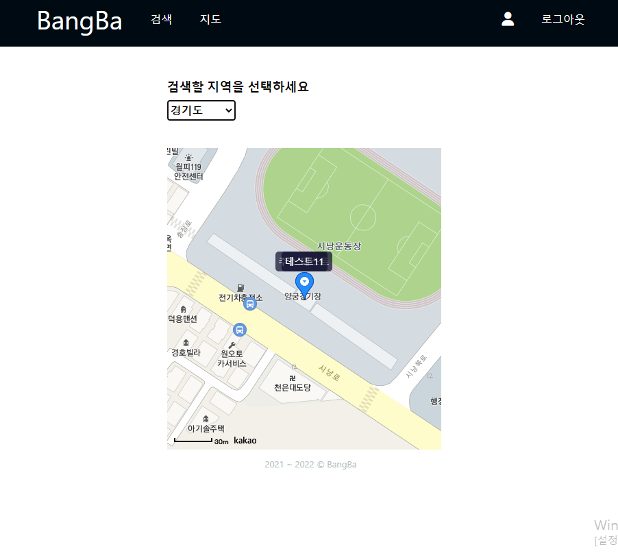

# BangBa 방탈출 매니아들의 바다

## 🔍 개요

방탈출 카페를 자주 가는 사람들이 방탈출 카페를 검색하려면 일일히 검색하거나 인터넷 카페를 통해 찾을수 밖에 없습니다.
그런 사람들을 위해 난이도별, 테마별로 찾아주는 홈페이지를 만들기로 했습니다.

## 💻 빌드

프로젝트 빌드

```
npm run build
```

프로젝트 실행

```
npm run server
```

## 📕 가이드

### 메인 페이지

.png>)

메인 페이지에서는 카페를 등록하거나 메뉴에서 로그인 등의 기능을 사용할 수 있습니다.

- 메뉴(주황색 테두리)
  1. 검색 : 등록된 방탈출 카페를 검색할 수 있습니다.
  2. 지도 : 등록된 방탈출 카페의 위치를 지역별로 지도를 통해 한눈에 확인할 수 있습니다.
  3. 회원가입 : 계정을 새로 가입할 수 있습니다.
  4. 로그인 : 일반 계정에 로그인하거나 소셜 로그인 기능을 사용할 수 있습니다.
- 방탈출 카페 등록(파란색 테두리)  
  사용자가 경험했거나 다른 사용자들에게 알려주고 싶은 방탈출 카페를 등록할 수 있습니다.
- 테마 찾기(검정색 테두리)  
  사용자가 관심 있는 테마를 지정하여 테마에 맞는 방탈출 카페를 아래에서 확인할 수 있습니다.

만약 로그인된 상태라면 다음과 같은 메뉴가 나타납니다.

.PNG>)

로그인한 상태라면 회원가입, 로그인이 각각 프로필, 로그아웃 기능으로 전환됩니다.

- 프로필은 사용자의 정보와 등록한 카페, 댓글을 확인할 수 있습니다.
- 로그아웃은 다른 계정으로 접속하고 싶거나 에플리케이션을 끝내고 싶을 때 사용할 수 있습니다.

### 로그인 && 회원가입



로그인 화면입니다. 가입된 아이디와 비밀번호로 로그인할 수 있습니다.  
 만약 가입된 계정이 없다면 아래의 지금 회원가입하기 링크를 통해 회원가입을 할 수 있습니다.
또는 아래의 소셜 로그인을 통해 회원가입 없이 즉시 계정을 만들 수 있습니다.



회원가입 페이지입니다. 생성하고 싶은 아이디와 비밀번호를 이용하여 계정을 생성할 수 있습니다.

### 프로필



현재 로그인된 사용자의 정보를 확인할 수 있습니다.  
사용자가 등록한 카페와 댓글 내용을 전환할 수 있습니다.

### 카페 등록



카페의 이름, 주소, 테마 등을 지정하여 홈페이지에 등록할 수 있습니다.

### 카페 검색



카페 이름으로 검색하거나 조건에 따라 카페의 순서를 조정할 수 있습니다.  
난이도나 테마 별로 검색하고 싶다면 상세 검색 기능을 사용하면 됩니다.
카페의 이미지를 클릭하면 상세 페이지로 연결됩니다.

### 카페 상세 페이지

.PNG>)

카페 상세 페이지에서 카페의 테마와 등록 아이디 등을 확인할 수 있습니다.  
만약 카페를 등록한 당사자라면 수정, 삭제가 가능합니다.

.PNG>)

스크롤을 아래로 내리면 카페의 위치를 확인할 수 있는 카카오 지도가 표시됩니다.  
그 아래에는 방탈출 카페의 평점과 댓글, 추천 기능을 사용할 수 있습니다.

### 한눈에 보기



지역별로 등록된 카페를 카카오 지도를 통해 한눈에 파악할 수 있습니다.  
카페 이름을 클릭하면 방탈출 카페 상세 페이지로 이동합니다.

---

## 🔨 기술 스택

<center>
<h3>Frontend</h3>
</center>

<center>
  
</center>

<center>
<h3>Backend</h3>
</center>

<center>
   
</center>

<center>
<h3>ETC</h3>
</center>

<center>
    
</center>

---

## 📱 연락처

📧 email: somn45@gmail.com  
📞 phone: 010-2823-3075
